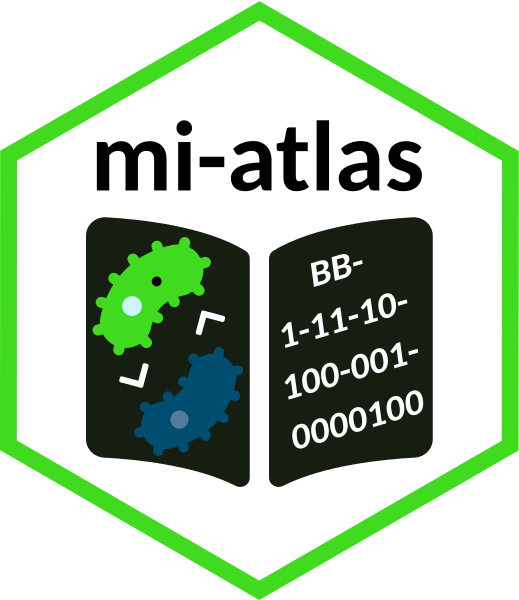

# mi-atlas: a Microbial Interactions Atlas 

## Rationale

A framework was recently suggested to describe interactions occurring between microorganisms using the encoding of several (binary) features in order to build a catalog amenable to quantitative analyses ([Pacheco and Segrè, 2019](https://doi.org/10.1093/femsle/fnz125)).
Their initial effort described 74 interactions which were unfortunately available only in the Supplementary Material section of the article.
Therefore, the objective of [mi-atlas](https://github.com/cpauvert/mi-atlas) (pronounced `/'mi atlas/` like in Spanish) is two-fold:

1. browse interactively the catalog
2. enable versioned community contributions to the microbial interactions catalog

To do so, this project will rely on a Shiny application to render the multi-column catalog into human-readable entries upon selection of the interaction of interest.
Contributions to the catalog will be possible through the use of the system already in place in Github: [pull request](https://docs.github.com/en/github/collaborating-with-issues-and-pull-requests/about-pull-requests).
New entries could then be discussed and reviewed before acceptance using the [pull request review](https://docs.github.com/en/github/collaborating-with-issues-and-pull-requests/about-pull-request-reviews#about-pull-request-reviews).

A builder will be designed to ease the addition of a new entry to the catalog that follows the framework guidelines.

## Reference

If you are using the atlas and/or the framework please cite the original article:

> Alan R Pacheco, Daniel Segrè, A multidimensional perspective on microbial interactions, *FEMS Microbiology Letters*, Volume 366, Issue 11, June 2019, fnz125, https://doi.org/10.1093/femsle/fnz125

## License

This work is licensed under the terms of the GNU General Public License v3.0. The logo follows the specifications of [StickersStandard](https://github.com/terinjokes/StickersStandard). It is made up of the following [Font Awesome](https://fontawesome.com) icons (bacteria, atlas and chevron-up) which are [licensed](https://fontawesome.com/license) under the Creative Commons Attribution 4.0 International and were slightly modified.
