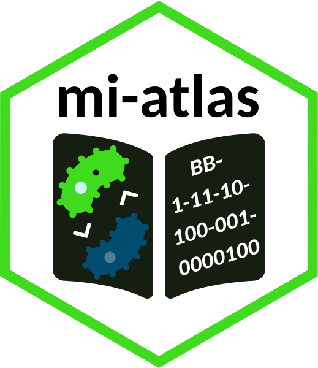

# mi-atlas: a Microbial Interactions Atlas 

## Description

A framework was recently suggested to describe interactions occurring between microorganisms using the encoding of several *attributes* (see below for details) in order to build a catalog amenable to quantitative analyses ([Pacheco and Segrè, 2019](https://doi.org/10.1093/femsle/fnz125)).
Their initial effort described 74 interactions which were unfortunately available only in the Supplementary Material section of the article.
Therefore, [mi-atlas](https://github.com/cpauvert/mi-atlas) (pronounced `/'mi atlas/` like in Spanish) aims to:

1. propose an [interactive exploration](https://cpauvert.shinyapps.io/mi-atlas) of the catalog and
2. enable versioned community contributions to the microbial interactions catalog

## Attributes of microbial interactions

### Attributes formatting and encoding

The attributes definitions are adapted from the Table 1 of ([Pacheco and Segrè, 2019](https://doi.org/10.1093/femsle/fnz125)) and can be read as follows:

> **Attribute type** Definition of the attribute. *Quantification of the attribute*.

The encoding of each of the attributes is described in the following table:

| **Encoding** |  **Binary** | **Ternary** |
|:------------:|:-----------:|:-----------:|
|      `0`     | Not present |   Neutral   |
|      `1`     |   Present   |  Beneficial |
|     `NA`     |   Unknown   |   Unknown   |
|     `-1`     |             | Detrimental |

### Attributes list

**Specificity**. The reported mechanism of interaction is deployed in a manner specific to the recipient (e.g. signaling molecules specific to one species vs. nonspecific secretion of waste products). *Binary*.

**Cost**. Establishment of the reported interaction (e.g. secretion of a metabolite) imposes a fitness burden on an organism involved (i.e. the individual fitness/growth rate of the organism would initially have been greater had it not established the interaction). *Binary*.

**Ecological outcome**. The ultimate ecological effect the interaction confers on each participant. Combining these values for both participants in a pairwise interaction yields its overall ecological outcome (e.g. 1,-1 corresponds to selfishness; 1,1 corresponds to mutualism, etc.). *Ternary*.

**Contact dependence**. Interaction is reported to occur only if direct physical contact between the different species is present. *Binary*.

**Time dependence**. Interaction is reported to occur only in a specific temporal frame (e.g. occurring only at one point in a circadian cycle). *Binary*.

**Spatial dependence**. Interaction is reported to occur only if organisms are in a specific spatial configuration. *Binary*.

**Site** The site, relative to the microbes involved, in which the interaction is reported to take place: extracellular (e.g. signaling molecule release or metabolic exchange), membrane (e.g. protein docking or conjugation), or cytoplasm (e.g. direct predation). *Binary value for each site*.

**Habitat** The biome(s) in which the interaction or participating organisms have been observed: aquatic, biofilm, food product, multicellular host, soil, synthetic, or ubiquitous. *Binary value for each habitat*.

**Compounds involved** The type of molecule that mediates the interaction: small molecules (e.g. carbohydrates or metabolic intermediates, but not secondary metabolites), nucleic acids (e.g. DNA), peptides (e.g. amino acids), or secondary metabolites (e.g. quorum sensing molecules). *Binary value for each compound type*.

Beforehand, each interaction is also described with the scientific names of each participant, the taxonomic resolution (e.g. Genus - species) as well as the domain of each participant (Bacteria, Archaea, Eukarya, Viruses). 
The exact names of the columns of the .tsv file are listed in the following [table](https://github.com/cpauvert/mi-atlas/blob/main/columns-mi-atlas.tsv) where they are grouped in the aforementioned categories.

## Contributing

Contributions to the catalog in the form of corrections and/or new entries are welcome and possible. If you are interested, please have a look at the [CONTRIBUTING guidelines](CONTRIBUTING.md). 

## Expected developments

Several [milestones](https://github.com/cpauvert/mi-atlas/milestones) are already set for incremental improvements of the two aims of the project.

*Spoiler alert*: a [Shiny application](https://cpauvert.shinyapps.io/mi-atlas) is now used to render the multi-column catalog into human-readable entries upon selection of the interaction of interest.
In the future, a builder will be designed to ease the addition of a new entry to the catalog that follows the framework guidelines.
And ideally new entries could be discussed and reviewed before acceptance using the [pull request review](https://docs.github.com/en/github/collaborating-with-issues-and-pull-requests/about-pull-request-reviews#about-pull-request-reviews) system.

## Reference

If you are using the atlas and/or the framework please cite the original article:

> Alan R Pacheco, Daniel Segrè, A multidimensional perspective on microbial interactions, *FEMS Microbiology Letters*, Volume 366, Issue 11, June 2019, fnz125, https://doi.org/10.1093/femsle/fnz125

## License

This work is licensed under the terms of the GNU General Public License v3.0. The logo follows the specifications of [StickersStandard](https://github.com/terinjokes/StickersStandard). It is made up of the following [Font Awesome](https://fontawesome.com) icons (bacteria, atlas and chevron-up) which are [licensed](https://fontawesome.com/license) under the Creative Commons Attribution 4.0 International and were slightly modified.
